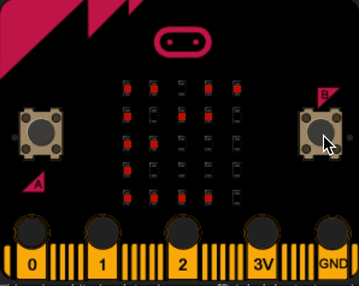

# microbit_hopfield
A simple <a href="https://en.wikipedia.org/wiki/Hopfield_network">hopfield</a> network implementation running on the BBC micro bit

### It goes as follow:

1. A bunch of random patterns are learnt by the network and one of them will be the target.  
2. When the user presses 'B', the target pattern will be randomly altered (up to 64%).  
3. Then, the network will try to restore the original pattern.  
4. Press 'A' to see the original pattern.  
5. Restart with microbit to set new patterns and learn again.  

Visualization using the <a href="http://blog.withcode.uk/2016/05/microbit-python-simulator/">microbit-python-simulator</a>
